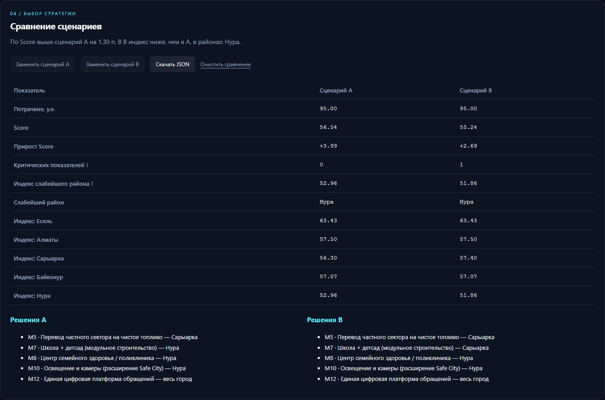

# Аким на 5 часов

AI-симулятор городского управления: 100 у.е., 5 решений, 5 районов,
14 мероприятий и итоговый **Astana Quality of Life Score**.
Синтетические показатели учебной модели не являются статистикой или прогнозом реальной Астаны.



## Сравнение стратегий

После расчёта нажмите «Сохранить как A». Измените меры или район, рассчитайте снова
и нажмите «Сохранить как B». Таблица сравнивает бюджет, Score и его прирост,
критические показатели, слабейший район и индексы всех пяти районов.
Под таблицей приведены решения каждого сценария. Пояснение отмечает разницу Score
и районы, где B уступает A; оно рассчитывается по числам, независимо от доступности AI.

Сохранённые сценарии не меняются при редактировании выбора или его сбросе.
Кнопки «Заменить сценарий» явно перезаписывают соответствующий результат.
Снимки хранятся до перезагрузки страницы. «Скачать JSON» сохраняет оба результата,
решения и доступный на момент сохранения AI-анализ в `akim-scenarios.json`.
Импорт файла и общая таблица команд пока не реализованы.

## Устройство проекта

Браузер получает единый каталог через `/api/data`, отправляет решения в `/api/simulate`
и показывает результат детерминированного движка `engine.py`. Для объяснения он вызывает
`/api/analyze`: сервер заново проверяет решения и формирует факты для OpenAI.
Таким образом, расчёт бюджета и Score не зависит от ответа модели. UI использует
HTML/CSS/JavaScript, API — FastAPI и Pydantic, AI — официальный OpenAI SDK.

## Воспроизводимое окружение

`requirements-lock.txt` фиксирует полный набор версий приложения и инструментов тестирования.
Он проверяется на Windows с Python 3.14; совместимость этого точного набора с другими
версиями Python отдельно не подтверждена. Для повторения окружения вместо установки
`requirements.txt` используйте:

```powershell
.venv\Scripts\python -m pip install -r requirements-lock.txt
.venv\Scripts\python -m pip check
.venv\Scripts\python -m unittest -v
```

На macOS/Linux в активированном окружении замените `.venv\Scripts\python` на `python`.
Обычный запуск по `requirements.txt` остаётся доступен без установки браузерных тестов.

## Запуск сайта и API

Нужен Python 3.10 или новее. Все команды выполняются из папки проекта.
Проверьте версию: `python3 --version` (macOS/Linux) или `python --version` (Windows).

### macOS / Linux (zsh или bash)

```bash
python3 -m venv .venv
source .venv/bin/activate
python -m pip install -r requirements.txt
export OPENAI_API_KEY="ваш новый API-ключ"
export OPENAI_MODEL="идентификатор доступной вам модели Responses API"
python -m uvicorn main:app --reload
```

Если на Mac установлен только Python 3.9, установите Python 3.12
(при установленном Homebrew: `brew install python@3.12`) и используйте
`python3.12 -m venv .venv` вместо первой команды.
Если окружение уже создано на старой версии Python, выполните `deactivate`,
переименуйте его (`mv .venv .venv-backup`), затем создайте новое и установите зависимости.
Старое окружение не нужно активировать снова; его резервную папку не добавляйте в Git.

Команды `export` задают настройки только для текущего терминала. Запускайте сервер в нём же.
Чтобы остановить сервер, нажмите Ctrl+C; чтобы выйти из окружения — `deactivate`.

### Windows (PowerShell)

```powershell
python -m venv .venv
.venv\Scripts\python -m pip install -r requirements.txt
$env:OPENAI_API_KEY = "ваш API-ключ"
$env:OPENAI_MODEL = "идентификатор доступной вам модели Responses API"
.venv\Scripts\python -m uvicorn main:app --reload
```

Откройте **http://127.0.0.1:8000**. Сайт и API работают на одном сервере.
Swagger: http://127.0.0.1:8000/docs. Открывать `index.html` двойным кликом не нужно.
Без ключа и модели расчёт работает, а AI-анализ показывает ошибку настройки и кнопку повтора.
Ключ задаётся только на сервере, не передаётся браузеру и не хранится в репозитории.
Файлы `.env` автоматически не загружаются.

Если появляется `Address already in use`, остановите предыдущий сервер через Ctrl+C
или выберите другой порт. Например, после активации окружения на macOS/Linux:

```bash
python -m uvicorn main:app --reload --port 8001
```

Тогда откройте **http://127.0.0.1:8001**.
На Windows используйте `.venv\Scripts\python` вместо `python`.

## Как пользоваться

1. Изучите районы и правила модели. Все начинают с одинаковых данных и бюджета.
2. Выберите ровно 5 мер, назначьте районы районным мерам. Городские действуют во всех районах.
3. Нельзя превысить бюджет, выбрать более двух мер одного направления или несовместимые меры.
4. Нажмите «Рассчитать и получить AI-анализ». Score, изменения районов и синергии появятся после расчёта; AI — после отдельного запроса.
5. Изменение выбранных мер или их районов сбрасывает старый расчёт и анализ.

Интерфейс загружает исходные данные через `/api/data`; Score рассчитывает только `engine.py`.
Ошибка AI не стирает рассчитанный результат. Кнопка «Повторить AI-анализ» повторяет запрос.
Пока запрос выполняется, изменение сценария заблокировано.

## Модель

T1/T2 — транспорт, E1/E2 — экология и озеленение, S1/S2 — социальная инфраструктура,
B1/B2 — безопасность, C1/C2 — городские сервисы. Это условные индексы 0–100,
где больше — лучше. Датасет задаёт названия и смысл шкал; значения индексов
не являются фактическими измерениями AQI, площади зелени или числа происшествий.

| Код | Показатель |
| --- | --- |
| T1 | Разгрузка дорог |
| T2 | Доступность общественного транспорта |
| E1 | Озеленение |
| E2 | Качество воздуха |
| S1 | Школы и детсады |
| S2 | Поликлиники и первичная медпомощь |
| B1 | Безопасность улиц |
| B2 | Безопасность дорожного движения |
| C1 | Надёжность ЖКХ |
| C2 | Скорость решения обращений жителей |

Названия 14 мероприятий и описания шкал хранятся в `catalog.py`
по документу «Датасет районов.pdf», страницы 1–3. API передаёт их интерфейсу,
а также AI вместе с результатами расчёта.

- Горизонт — 8 кварталов; реализованный эффект = эффект × (8 − lag) / 8.
- Показатель = clip(старт + эффекты + синергии, 0, 100).
- Индекс района — взвешенная сумма 10 показателей; средний индекс учитывает доли населения.
- Score = 0.7 × средний индекс + 0.3 × минимальный индекс района − число показателей строго ниже 40.
- Каждая мера выбирается один раз. Ровно пять решений, не более двух из одного направления.
- По одной мере каждого направления выбирать не обязательно — это соответствует эталону задачи.
- M1 и M3 несовместимы; M4 + M7 и M5 + M13 запрещены в одном районе.
- Синергии M1 + M2, M10 + M12, M5 + M6 дают соответственно T1 +2, B1 +2, E2 +2
  в районе первой меры, без масштабирования задержкой.

## API

`GET /api/data`: каталог мер, показатели и доли населения, веса, исходные индексы, пояснения и правила.

`POST /api/simulate` принимает объект ниже или непосредственно массив мер:

```json
{
  "selected_measures": [
    {"id": "M7", "district": "Нура"},
    {"id": "M8", "district": "Нура"},
    {"id": "M10", "district": "Нура"},
    {"id": "M12"},
    {"id": "M5", "district": "Сарыарка"}
  ]
}
```

Успех: `status: "ok"`, `score_before`, `score_after`, `score_delta`, `budget`,
`selected_measures`, `districts`, `synergies`, `summary_before`, `summary_after`.
Для района: показатели `before`/`after`, `deltas`, индексы и критические метрики.
Невалидное решение: HTTP 422, `status: "error"`, `error`, `errors`.

`POST /api/analyze` принимает тот же объект `selected_measures` или полный успешный ответ симуляции.
Сервер повторно валидирует решения и рассчитывает достоверные факты через движок;
присланные клиентом Score, бюджет, эффекты и изменения районов игнорируются.
LLM получает серверные факты и системный промпт советника; числа модель не рассчитывает.
Успех: `{"status":"ok","analysis":"Текст анализа в Markdown"}`.
Используется официальный OpenAI SDK и [Responses API](https://developers.openai.com/api/docs/guides/text).

Ошибки анализа: 422 — решения невалидны, 503 — отсутствует настройка, 429 — лимит/квота,
504 — тайм-аут, 502 — ошибка провайдера или неполный ответ. SDK использует тайм-аут 45 секунд,
без автоматических повторов; браузер прекращает ожидание через 60 секунд.
CORS поддерживает HTTP/HTTPS localhost, 127.0.0.1 и [::1] на любом порту.

## Проверка для жюри

Короткая демонстрация на 3 минуты:

1. Покажите исходный Score 52.56, единый бюджет и названия инициатив.
2. Загрузите эталон, рассчитайте, сохраните как A: Score 56.54, критических показателей 0.
3. Перенесите M7 в Сарыарку, рассчитайте и сохраните как B: Score 55.24,
   критических показателей 1. Объясните компромисс: Сарыарка выигрывает, Нура уступает.
4. Покажите сравнение, выгрузите JSON и прочитайте AI-рекомендацию, если настроен ключ.
5. Покажите запрет несовместимой меры и запуск с неполным набором решений.

Для реального применения понадобятся калибровка эффектов на городских данных,
учёт неопределённости и проверка рекомендаций специалистом. Возможные следующие шаги:
сохранение сценариев команд на сервере, анализ чувствительности к весам Score,
случайные события и сравнение нескольких горизонтов. Эти возможности пока не реализованы.

- Кнопка «Загрузить эталонный набор»: бюджет 95; Score 52.55768 → **56.54307**,
  прирост 3.98539; критических показателей становится 0 вместо 2.
- Измените район M7 на Сарыарку и повторите: при том же бюджете Score **55.24387**.
- Сбросьте выбор: с 1–4 решениями расчёт недоступен. Недоступные меры поясняют причину блокировки.
- Проверьте M1 + M3 и M4 + M7 в одном районе: интерфейс и сервер запрещают сочетания.
- При работающем OpenAI AI объясняет стратегию, победы, компромиссы и следующий шаг.
  Перед демонстрацией проверьте реальный вызов с вашим ключом и моделью; автоматические тесты SDK подменяют.

## Тесты

macOS/Linux, после активации окружения:

```bash
python -m pip install -r requirements-dev.txt
python -m unittest -v
```

Проверка синтаксиса JavaScript, если установлен Node.js: `node --check app.js`.
Для обычного запуска сайта Node.js не нужен.

Windows:

```powershell
.venv\Scripts\python -m pip install -r requirements-dev.txt
.venv\Scripts\python -m unittest -v
node --check app.js
```

Проверка интерфейса в установленном Microsoft Edge (Windows):

```powershell
.venv\Scripts\python browser_smoke.py
```

Скрипт временно запускает сервер на свободном локальном порту, проверяет выбор,
бюджет, несовместимости, смену Score, повтор AI и мобильную ширину, затем останавливает сервер.
Ответ AI подменяется; реальные API-запросы к модели не выполняются.

Файлы: `engine.py` — математика; `main.py` — API и раздача сайта;
`catalog.py` — названия и пояснения из датасета;
`index.html`, `styles.css`, `app.js` — интерфейс; `test_*.py` — тесты.
