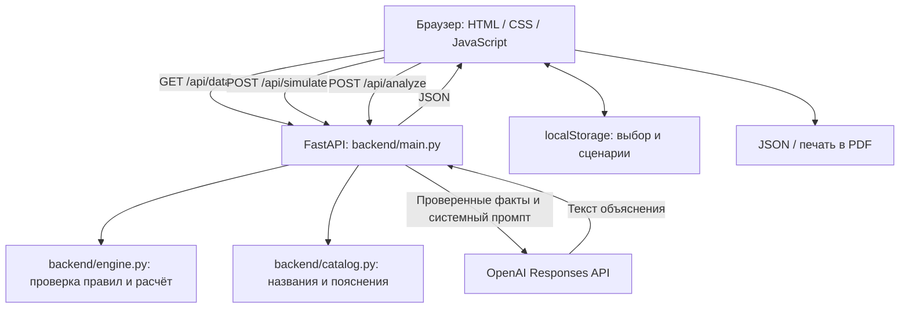

# QalaAI: Цифровой советник акима

**AI-симулятор городского управления по задаче хакатона «Аким на 5 часов».**
Пользователь распределяет бюджет **100 условных единиц**, выбирает **ровно пять решений**
и получает **Astana Quality of Life Score**, изменения показателей районов и объяснение AI.

Документация описывает текущие функции проекта, включая рейтинг районов, разбор Score, поиск улучшений и импорт сценариев.

## 1. Проблема и пользователи

При ограниченном бюджете городские инициативы конкурируют за ресурсы: улучшение транспорта
не обязательно решает дефицит школ, а высокий средний результат может скрывать проблемы
отдельного района. QalaAI позволяет проверить такие компромиссы на одной модели,
сравнить два набора решений и объяснить полученные результаты.

Решение предназначено для участников симуляции, городских аналитиков и управленцев,
которым нужен наглядный учебный инструмент для обсуждения приоритетов.
Данные и эффекты мероприятий синтетические: проект не прогнозирует реальное состояние Астаны.

## 2. Что реализовано

- **Единый исходный город:** пять районов, десять показателей на район, 14 мероприятий и бюджет 100 у.е.
- **Выбор инициатив:** фильтры по пяти направлениям, названия мероприятий, стоимость,
  задержка эффекта и назначение района для локальных мер.
- **Контроль правил:** ровно пять решений, отсутствие повторов, не более двух мер одного направления,
  запрет превышения бюджета и несовместимых сочетаний. Проверки есть в интерфейсе и на сервере.
- **Расчёт результата:** Score до/после, прирост, индексы районов, изменения всех показателей,
  критические значения ниже 40 и сработавшие синергии.
- **AI-советник:** объяснение стратегии, преимуществ, рисков, компромиссов и следующего шага.
  При ошибке AI числовой результат сохраняется; доступна кнопка повторного анализа.
- **Сравнение A/B:** два сохранённых сценария, их решения, бюджет, Score, критические показатели,
  слабейший район, индексы районов и доступные AI-ответы. Различия чисел объясняются без обращения к AI.
- **Экспорт:** сценарии A/B в JSON и отчёт по текущему расчёту в PDF через окно печати браузера.
- **Автосохранение:** выбранные меры, районы, категория, расчёт, AI-ответ и сценарии A/B
  восстанавливаются из `localStorage` после обновления страницы.
- **Интерфейс для компьютера и телефона:** пять разделов, подсказки по шагам,
  выбор отображаемого района, нижняя панель бюджета и расчёта, светлое оформление
  и фотография Астаны в шапке, адаптированная под ширину экрана.

В интерфейсе доступны разделы **«Решения»**, **«Районы и результат»**, **«AI-советник»**,
**«Сравнение»** и **«Как играть»**. Навигация поддерживает стрелки и клавиши Home/End.

| Раздел | Что доступно пользователю |
| --- | --- |
| Решения | Категории, карточки инициатив, выбор района, краткий список выбранного и эталонный набор |
| Районы и результат | Переключение между пятью районами, исходные и итоговые индексы, десять показателей выбранного района |
| AI-советник | Объяснение, повтор запроса при ошибке и PDF-отчёт |
| Сравнение | Снимки A/B, различия результатов, сохранённые AI-ответы и экспорт JSON |
| Как играть | Правила модели, формула Score, синергии и удаление сохранённых данных |

Закреплённая навигация и подсказка под ней помогают пройти сценарий. После расчёта
автоматически открывается раздел результатов. Выбранную инициативу можно убрать
нажатием на неё в кратком списке над карточками.

### Приоритеты районов и улучшение плана

Во вкладке «Районы и результат» есть рейтинг от слабейшего района к сильнейшему.
До расчёта он показывает исходные индексы, после — итоговые; рядом указано число
критических показателей. Нажатие на район открывает его подробности.

Разбор прироста Score показывает три отдельных вклада относительно старта:
изменение среднего индекса × 0,7, изменение минимального индекса × 0,3 и изменение
штрафа за критические показатели. Их сумма равна приросту Score до округления.

Кнопка «Найти улучшение» перебирает все допустимые замены одного из пяти решений.
Можно заменить меру и/или её район; остальные четыре решения сохраняются.
Движок проверяет бюджет, направления, несовместимости, задержки и синергии и выбирает
вариант с максимальным Score. При равенстве предпочитается меньшая стоимость,
затем стабильный порядок идентификаторов и районов.

Показываются прирост Score, разница расходов и изменения индексов районов относительно
текущего плана, включая ухудшения. «Применить вариант» обновляет выбор и результат,
сбрасывает прежний AI-анализ и сохраняет новый план в браузере. Сценарии A/B не меняются.
Для нового плана можно отдельно запросить анализ во вкладке советника.
Сам поиск не требует API-ключа и не вызывает LLM; пояснение изменений строится по расчёту.
Это лучший вариант среди замен одного решения, а не глобальный оптимум среди всех планов.
Если улучшений нет, интерфейс явно сообщает об этом.

## 3. Как работает решение

1. Браузер запрашивает у сервера исходные показатели, каталог мероприятий и правила.
2. Пользователь изучает районы, собирает пакет из пяти мер и назначает районы локальным инициативам.
3. Интерфейс показывает стоимость и причины недоступности мер. Невалидный набор нельзя отправить кнопкой расчёта.
4. Сервер повторно проверяет набор и вычисляет эффект мер с учётом задержек, синергий и ограничений шкалы.
5. Пользователь видит Score и изменения районов. Затем отдельный запрос получает текст AI-советника.
6. Результат можно сохранить как A, изменить решения, рассчитать вариант B и сравнить их.
   Для передачи результата доступны JSON и печатный PDF-отчёт.

Изменение выбранных решений сбрасывает текущий расчёт и анализ. Сохранённые A/B при этом
остаются отдельными снимками. Обновление страницы восстанавливает сохранение без нового AI-запроса.

## 4. Технологии

| Компонент | Технологии и назначение |
| --- | --- |
| Интерфейс | HTML5, CSS, обычный JavaScript; DOM, Fetch API, `localStorage`, печать браузера |
| Сервер | Python, FastAPI, Uvicorn; раздача интерфейса и HTTP API |
| Валидация запросов | Pydantic |
| Расчётная модель | Python, стандартная библиотека; отдельный модуль без внешних зависимостей |
| AI | Официальный Python SDK `openai`, OpenAI Responses API |
| Тесты сервера | `unittest`, `unittest.mock`, FastAPI TestClient, HTTPX |
| Проверка браузера | Playwright, установленный Chrome или Microsoft Edge |

**Конкретная AI-модель не зафиксирована в коде.** Её идентификатор задаётся через
`OPENAI_MODEL` и должен быть доступен вашему API-проекту и поддерживать используемый Responses API.
Версия SDK в файле зависимостей не является названием модели.

Основной сайт не требует React, Tailwind, Node.js или сборки фронтенда.
Node.js используется только для необязательной проверки синтаксиса `frontend/app.js`.

## 5. Архитектура



Сайт, его CSS/JavaScript, фотографию `/img/ast.jpg` и API обслуживает один процесс FastAPI. Расчёт бюджета и Score выполняется кодом
в `backend/engine.py` и не зависит от ответа LLM. Перед запросом AI сервер заново рассчитывает
факты по выбранным мерам: присланные клиентом Score, стоимость и другие результаты игнорируются.
Названия мер и расшифровки показателей также поступают из серверного каталога.

| Файл | Назначение |
| --- | --- |
| [`frontend/index.html`](frontend/index.html) | Структура интерфейса |
| [`frontend/styles.css`](frontend/styles.css) | Оформление, адаптация, стили печатного отчёта |
| [`frontend/img/ast.jpg`](frontend/img/ast.jpg) | Локальная фотография Астаны для шапки; сервер выдаёт её по `/img/ast.jpg` |
| [`frontend/app.js`](frontend/app.js) | Выбор мер, запросы API, отображение, сохранение и экспорт |
| [`backend/engine.py`](backend/engine.py) | Исходные числа, эффекты, правила и формула Score |
| [`backend/catalog.py`](backend/catalog.py) | Названия мероприятий и смысл показателей |
| [`backend/main.py`](backend/main.py) | FastAPI, схемы запросов, раздача сайта, интеграция AI |
| [`requirements.txt`](requirements.txt) | Зависимости приложения с диапазонами версий |
| [`requirements-dev.txt`](requirements-dev.txt) | Дополнительные зависимости тестирования |
| [`requirements-lock.txt`](requirements-lock.txt) | Зафиксированный набор версий приложения и инструментов тестирования |
| [`tests/test_engine.py`](tests/test_engine.py), [`tests/test_main.py`](tests/test_main.py), [`tests/test_analyze.py`](tests/test_analyze.py) | Тесты модели, API и AI-интеграции с подменой провайдера |
| [`tests/test_improve.py`](tests/test_improve.py) | Проверки поиска улучшений и разложения Score |
| [`tests/browser_smoke.py`](tests/browser_smoke.py) | Проверка пользовательского сценария в браузере |

### Структура репозитория

```text
backend/               # Python-пакет: API, расчёт и каталог
  main.py              # FastAPI, валидация запросов и AI-анализ
  engine.py            # Математика и поиск улучшений
  catalog.py           # Названия и описание показателей
frontend/              # Страница, JavaScript, CSS и img/
tests/                 # Модульные/API-тесты и browser_smoke.py
docs/                  # Иллюстрации документации
.github/workflows/     # Проверки GitHub Actions
artifacts/             # Генерируемые отчёты тестов (игнорируются Git)
main.py                # Совместимый вход для uvicorn main:app
requirements*.txt      # Зависимости приложения, разработки и lock-файл
```

Все команды ниже выполняются из корня репозитория. Сервер можно также запускать
через `python -m uvicorn backend.main:app --reload`. Фронтенд раздаётся по прежним
URL; пути к его файлам вычисляются относительно кода сервера, а не текущей папки.
Для импорта движка используйте `from backend.engine import simulate`.
Виртуальное окружение `.venv/` содержит только локальные зависимости и не переносится в Git.

При push и pull request GitHub Actions устанавливает зафиксированные зависимости,
проверяет их совместимость, запускает тесты сервера и проверку синтаксиса JavaScript.
Браузерная проверка запускается отдельно командой `python -m tests.browser_smoke`;
ключ OpenAI для тестов не нужен.

## 6. Установка и запуск

### Требования

- Python **3.10 или новее**. Серверные тесты текущей версии проверены локально на Python 3.12.
- `pip`, современный браузер и Git для клонирования.
- Интернет для установки зависимостей. Для AI дополнительно нужны API-ключ, доступная модель
  и возможность обращения к OpenAI. Числовая симуляция работает без AI-настроек.

### Получение проекта

```bash
git clone https://github.com/BAITC-Hacks/hack-e4350f2f-astra.git
cd hack-e4350f2f-astra
```

Если репозиторий уже есть, откройте его папку. Все дальнейшие команды выполняются из неё.

### Обновление уже скачанного проекта

Остановите работающий сервер через Ctrl+C. Проверьте локальные изменения и получите
обновления ветки `main`:

```bash
git status
git pull --ff-only origin main
```

Если Git сообщает о конфликте с локальными файлами, сохраните свою работу перед обновлением.
После успешного обновления повторите установку `requirements.txt` и запуск сервера
по инструкции для своей ОС. Уже существующее окружение `.venv` заново создавать не нужно.

### macOS / Linux — zsh или bash

```bash
python3 --version
python3 -m venv .venv
source .venv/bin/activate
python -m pip install -r requirements.txt
python -m uvicorn main:app --reload
```

Если `python3` указывает на Python 3.9, сначала установите более новую версию.
Например, при уже установленном Homebrew на macOS: `brew install python@3.12`,
затем создайте окружение командой `python3.12 -m venv .venv`.

### Windows — PowerShell

```powershell
python --version
python -m venv .venv
.venv\Scripts\python -m pip install -r requirements.txt
.venv\Scripts\python -m uvicorn main:app --reload
```

В этих командах Windows используется Python из окружения напрямую; активировать его не требуется.

Откройте **[http://127.0.0.1:8000](http://127.0.0.1:8000)**.
Интерактивная документация API: **[http://127.0.0.1:8000/docs](http://127.0.0.1:8000/docs)**.
`frontend/index.html` нужно открывать через сервер, а не двойным кликом.
Остановить сервер можно через **Ctrl+C**.

### Настройка AI

Остановите сервер и задайте переменные в том же терминале перед повторным запуском.
Замените оба значения-заглушки своими настройками.

macOS/Linux, с активированным окружением:

```bash
export OPENAI_API_KEY="ваш_API_ключ"
export OPENAI_MODEL="идентификатор_доступной_модели"
python -m uvicorn main:app --reload
```

Windows PowerShell:

```powershell
$env:OPENAI_API_KEY = "ваш_API_ключ"
$env:OPENAI_MODEL = "идентификатор_доступной_модели"
.venv\Scripts\python -m uvicorn main:app --reload
```

| Переменная | Назначение |
| --- | --- |
| `OPENAI_API_KEY` | Ключ для серверного обращения к OpenAI |
| `OPENAI_MODEL` | Идентификатор модели; значения по умолчанию нет |
| `BROWSER_CHANNEL` | Необязательный выбор установленного браузера для `tests/browser_smoke.py` |

Переменные `export` и `$env:...` относятся к текущему терминалу.
Файлы `.env` **автоматически не загружаются**. Ключ не нужно вставлять в `frontend/app.js` или HTML;
его читает сервер из окружения. `.env` и `.venv` исключены из Git.

Без ключа или модели приложение показывает ошибку настройки AI, сохраняя вычисленный результат.

### Зафиксированные зависимости

Для установки точных версий из репозитория вместо `requirements.txt` можно использовать
`requirements-lock.txt`. В активированном окружении macOS/Linux:

```bash
python -m pip install -r requirements-lock.txt
python -m pip check
```

На Windows замените `python` на `.venv\Scripts\python`.
Lock-файл включает инструменты тестирования; переносимость этого набора на все версии
Python и ОС не подтверждена. Для обычного запуска достаточно `requirements.txt`.

### Частые проблемы

| Симптом | Что сделать |
| --- | --- |
| `Address already in use` | Остановить предыдущий сервер или добавить `--port 8001`; открыть `http://127.0.0.1:8001` |
| `No module named uvicorn` | Установить `requirements.txt` тем Python, которым запускается сервер |
| `python3.12: command not found` | Установить Python 3.12 либо использовать другой установленный Python 3.10+ |
| zsh не принимает `$env:...` | Использовать `export`; синтаксис `$env:...` предназначен для PowerShell |
| AI недоступен | Проверить обе переменные в терминале сервера; при ошибке квоты проверить доступ API-проекта |
| После смены порта исчезло сохранение | Открыть прежний адрес: хранилище браузера различает порт и имя хоста |

## 7. Как проверить решение

### Сценарий для жюри

Если браузер уже хранит старый сценарий, откройте «Как играть» и нажмите
«Удалить сохранённые данные», чтобы начать с чистого состояния.

1. Откройте «Районы и результат», выберите Нуру. Исходный Score — **52.56**,
   критические значения: **S1 = 38**, **S2 = 35**.
2. Во вкладке «Решения» нажмите **«Загрузить эталонный набор»**. Он содержит:

   | Мера | Назначение | Район | Стоимость |
   | --- | --- | --- | ---: |
   | M7 | Школа + детсад | Нура | 24 |
   | M8 | Центр семейного здоровья / поликлиника | Нура | 20 |
   | M10 | Освещение и камеры | Нура | 12 |
   | M12 | Единая цифровая платформа обращений | Весь город | 14 |
   | M5 | Перевод частного сектора на чистое топливо | Сарыарка | 25 |

3. Нажмите **«Рассчитать и получить AI-анализ»**. Ожидаемые числовые результаты:

   | Показатель | Значение |
   | --- | ---: |
   | Расход / остаток | 95 / 5 у.е. |
   | Score до | 52.55768 |
   | Score после | 56.54307 |
   | Прирост Score | +3.98539 |
   | Критических показателей | 2 → 0 |
   | S1 в Нуре | 38 → 48 |
   | S2 в Нуре | 35 → 43.75 |

   Интерфейс округляет Score до **56.54 (+3.99)**. Срабатывает синергия M10 + M12.
4. После завершения запроса откройте «AI-советник». При настроенном API появится объяснение;
   без настройки — сообщение об ошибке и кнопка повтора. Числа останутся доступными в обоих случаях.
5. В разделе «Сравнение» сохраните результат как **A**. Вернитесь к решениям, поменяйте
   район M7 на **Сарыарку**, пересчитайте и сохраните как **B**.
   Бюджет останется 95, Score B будет **55.24387** (на экране **55.24**),
   критических показателей — **1**. A превосходит B по Score примерно на **1.30**.
6. Скачайте JSON сравнения. В «AI-советнике» нажмите **«Скачать отчёт (PDF)»**
   и выберите **«Сохранить как PDF»** в окне печати. Отчёт относится к текущему расчёту.
7. Обновите страницу: выбор, результат, полученный AI-ответ и A/B должны восстановиться.
   Перезагрузка сама по себе не вызывает AI повторно.

Числа эталона и альтернативы проверяются серверными тестами. Текст AI не фиксирован
и может отличаться при повторном запросе.

### Проверка ограничений

- После сброса с 1–4 мерами кнопка расчёта недоступна.
- При выбранной M1 нельзя добавить M3 в любом районе.
- M4 и M7 несовместимы в одном районе, но допускаются в разных.
- При выборе M3 + M5 + M7 в допустимых районах расход равен 79; M2 стоимостью 22 недоступна.
- Недопустимый запрос напрямую к API возвращает HTTP 422 и причины ошибки, без нового Score.

### Автоматические проверки

macOS/Linux, после активации `.venv`:

```bash
python -m pip install -r requirements-dev.txt
python -m unittest discover -s tests -t . -v
```

Windows:

```powershell
.venv\Scripts\python -m pip install -r requirements-dev.txt
.venv\Scripts\python -m unittest discover -s tests -t . -v
```

В четырёх файлах `tests/test_*.py` — **20 тестов**. Они проверяют эталонный результат, влияние решений,
ограничения, синергии, маршруты API, замену поддельных клиентских фактов серверными,
отсутствие AI-настроек и ошибки провайдера. AI-вызовы подменяются: тесты не расходуют квоту
и не подтверждают доступность реальной модели.

Браузерный сценарий использует установленный **Google Chrome на macOS/Linux**
или **Microsoft Edge на Windows**:

```bash
# macOS/Linux, активированное окружение
python -m tests.browser_smoke
```

```powershell
# Windows
.venv\Scripts\python -m tests.browser_smoke
```

Скрипт запускает временный сервер на свободном локальном порту, проверяет выбор, запреты,
расчёт, повтор AI, A/B, экспорт, восстановление сохранений и мобильную ширину, затем останавливает сервер.
Браузерный канал можно переопределить через `BROWSER_CHANNEL`. Установленный браузер нужен отдельно
от Python-пакета Playwright. AI также подменяется; PDF и снимки экрана записываются в `artifacts/` (не попадают в Git).

Необязательная проверка JavaScript при установленном Node.js:

```bash
node --check frontend/app.js
```

## 8. Данные, модель и интеграции

### Источник данных

Проект использует встроенный синтетический датасет задачи «Аким на 5 часов»:
**Есиль, Алматы, Сарыарка, Байконур и Нура**. Значения показателей, доли населения,
веса и эффекты мер находятся в `backend/engine.py`. Названия и описания в `backend/catalog.py`
ссылаются на «Датасет районов.pdf», страницы 1–3. Сам PDF не входит в отслеживаемые файлы репозитория;
для запуска данные из внешнего файла не требуются.

| Коды | Показатели |
| --- | --- |
| T1 / T2 | Разгрузка дорог / доступность общественного транспорта |
| E1 / E2 | Озеленение / качество воздуха |
| S1 / S2 | Школы и детсады / поликлиники и первичная медпомощь |
| B1 / B2 | Безопасность улиц / безопасность дорожного движения |
| C1 / C2 | Надёжность ЖКХ / скорость решения обращений жителей |

Все показатели имеют шкалу **0–100**, где больше — лучше. Это индексы, а не измеренные
значения AQI, площади зелени или количества происшествий. Подключения к городским данным в реальном времени нет.

### Правила и формула

- Бюджет — 100 у.е.; неиспользованный остаток не даёт бонуса.
- Ровно пять уникальных мер; не более двух из одного направления.
- Районная мера действует в одном указанном районе, городская — во всех пяти.
- M1 + M3 запрещены всегда; M4 + M7 и M5 + M13 запрещены в одном районе.
- Порядок решений не влияет на результат.
- Горизонт — восемь кварталов. Доля реализованного эффекта: `(8 − lag) / 8`.
- Синергии не масштабируются задержкой: M1 + M2 → T1 +2;
  M10 + M12 → B1 +2; M5 + M6 → E2 +2 в районе первой меры пары.

```text
Новый показатель = clip(исходный + сумма реализованных эффектов + синергии, 0, 100)
D_района = сумма(вес показателя × новый показатель)
D_avg = сумма(доля населения района × D_района)
N_crit = число пар «район × показатель» со значением строго ниже 40
Score = 0.7 × D_avg + 0.3 × min(D_района) − N_crit
```

### HTTP API

| Метод и путь | Назначение |
| --- | --- |
| `GET /api/data` | Каталог, исходные районы, базовый Score, веса, пояснения и правила |
| `POST /api/simulate` | Проверка решений и числовой результат |
| `POST /api/improve` | Поиск лучшей допустимой замены одного решения |
| `POST /api/analyze` | Проверка и повторный расчёт фактов, затем AI-объяснение |
| `GET /docs` | Интерактивная документация FastAPI |

Пример тела запроса для расчёта и анализа, который можно использовать в `/docs`:

```json
{
  "selected_measures": [
    {"id": "M7", "district": "Нура"},
    {"id": "M8", "district": "Нура"},
    {"id": "M10", "district": "Нура"},
    {"id": "M12"},
    {"id": "M5", "district": "Сарыарка"}
  ]
}
```

`/api/simulate` также принимает непосредственно массив мер. Ответ содержит
`score_before`, `score_after`, `score_delta`, `budget`, `districts`, `selected_measures`,
`indicator_info`, `synergies`, `summary_before`, `summary_after` и `status`.
`/api/analyze` возвращает `status` и текст `analysis`; можно передать ему и полный успешный ответ расчёта.

Поле `score_breakdown` содержит вклады `average`, `weakest`, `critical` в прирост Score.

`POST /api/improve` принимает `{"selected_measures": [...]}`. Возвращает `improved`,
`checked` (число допустимых проверенных вариантов), `scope: "one_decision"`,
`current_score`, `score_gain`, `budget_delta`, `removed`, `added`, `district_deltas`
и `candidate` — полный результат улучшенного сценария или `null`, если улучшения нет.
Невалидный исходный план получает HTTP 422. Эндпоинт не изменяет данные и не вызывает AI.

### Изображение в интерфейсе

Фотография в шапке хранится в репозитории как `frontend/img/ast.jpg` и отдаётся самим приложением.
Внешний сервис изображений при открытии сайта не вызывается. Изображение служит оформлением,
а не картой районов или источником расчётных данных.

### Внешний AI-сервис

Единственная внешняя интеграция приложения — OpenAI Responses API.
Сервер передаёт факты синтетического сценария, словарь показателей и системный промпт советника.
Вызов использует `store=False`, лимит 2000 выходных токенов, тайм-аут 45 секунд
и отключённые автоматические повторы. Браузер прекращает ожидание через 60 секунд.

Ошибки анализа: 422 — неверные решения; 503 — отсутствует конфигурация;
429 — лимит или квота; 504 — тайм-аут; 502 — ошибка провайдера или неполный ответ.
AI-текст отображается как текст, без исполнения присланного HTML.

## 9. Сохранение и экспорт

Сохранение привязано к браузеру и адресу сайта: протоколу, хосту и порту.
`localhost:8000`, `127.0.0.1:8000` и `127.0.0.1:8001` имеют разные хранилища.
При изменении данных модели старые расчёты и AI-ответы сбрасываются, а выбранные меры
проверяются по актуальным правилам. Повреждённое или недоступное хранилище не блокирует приложение.

- **«Сбросить»** очищает текущий сценарий, сохраняя A/B.
- **«Очистить сравнение»** очищает A/B.
- **«Удалить сохранённые данные»** в «Как играть» очищает выбор, расчёт, анализ и A/B,
  удаляя запись симулятора из `localStorage`.
- **«Скачать JSON»** выгружает сохранённые A/B с решениями, результатами и доступными AI-ответами.
- **«Скачать отчёт (PDF)»** открывает печать текущего расчёта: меры, бюджет, Score, синергии,
  показатели районов и AI-вердикт. Сохранение в PDF пользователь выбирает в диалоге браузера.

Если AI не ответил, PDF содержит числовой результат и пометку об отсутствии анализа.
Экспорт не отправляет дополнительный запрос к AI.

«Импорт JSON» открывает файл, скачанный из QalaAI (не более 1 МБ). Сценарии из файла
заменяют соответствующие слоты A/B только после успешной проверки всего файла.
Сервер заново рассчитывает результаты по актуальным правилам: числа и AI-тексты из файла
не используются. Слот, отсутствующий в файле, сохраняется. Общая таблица команд пока не реализована.

## 10. Ограничения текущей версии

- Фиксированный учебный датасет, эффекты и горизонт. Нет калибровки на реальной статистике,
  оценки неопределённости или моделирования неожиданных событий.
- Качество AI-объяснения зависит от выбранной модели. Тесты с подменой провайдера
  не заменяют проверку реального API-ключа и ответа перед демонстрацией.
- Нет регистрации, серверной базы сценариев, общей таблицы команд и синхронизации между устройствами.
- Сравнение ограничено двумя локальными сценариями. Импорт JSON повторно проверяется сервером.
- Локальные сохранения — пользовательские копии; они не являются проверенной сервером таблицей результатов соревнования.
- PDF формируется через печать браузера; серверной генерации PDF и презентаций нет.
- Нет авторизации и собственного ограничения частоты AI-запросов. Текущая конфигурация
  рассчитана на локальную демонстрацию; `--reload` предназначен для разработки.

## 11. Развёрнутая версия

**Подтверждённая ссылка на публичную deployed-версию в текущем репозитории не указана.**
Для проверки используйте локальный запуск по инструкции выше.
Исходный код: [BAITC-Hacks/hack-e4350f2f-astra](https://github.com/BAITC-Hacks/hack-e4350f2f-astra).
